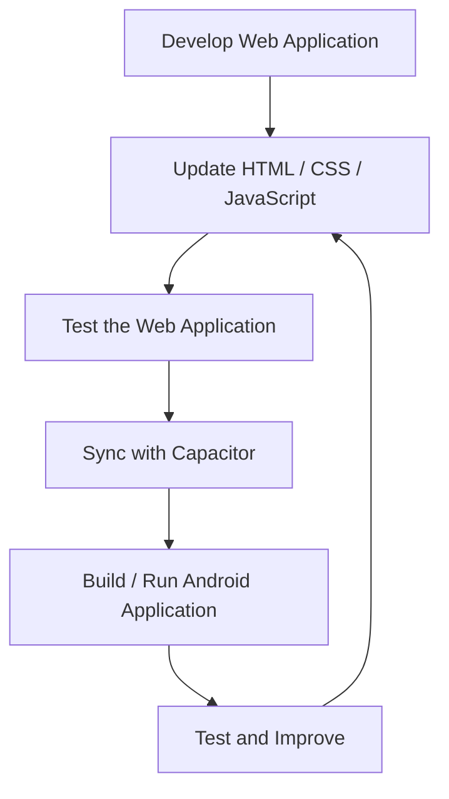

<div align="center">

# 📊 Dataset App

**A Final Year Design Project — a student check-in & dataset collection platform for Web and Android**


</div>

---

## 📑 Table of Contents

- [Project Overview](#-project-overview)
- [Main Technologies](#-main-technologies)
- [Project Structure](#-project-structure)
- [Features](#-features)
- [Data Collected](#-data-collected)
- [Installation and Setup](#️-installation-and-setup)
- [Android Application](#-android-application)
- [Development Workflow](#-development-workflow)
- [Future Improvements](#-future-improvements)
- [Academic Project](#-academic-project)
- [Author](#-author)

---

## 📌 Project Overview

**Dataset App** is an application for collecting and organizing dataset-related information in a simple, structured way. It was developed as a **Final Year Design Project** with the goal of providing a practical, user-friendly platform for dataset-based tasks.

Students fill in a quick **daily check-in** (study habits, sleep, phone usage, mood, stress and more). Every response is stored in **Firebase Firestore**, building a dataset that can later be analysed.

The project includes a **web interface** and an **Android application** generated with Capacitor.

---

## 🚀 Main Technologies

| Technology | Purpose |
|---|---|
| **HTML** | Web page structure |
| **CSS** | User interface styling |
| **JavaScript** | Application functionality |
| **Firebase Firestore** | Cloud database for storing check-ins |
| **Capacitor** | Android application integration |
| **Android Studio / Gradle** | Android project and build system |
| **Git & GitHub** | Version control and project management |

---

## 📁 Project Structure

```
dataset-app/
│
├── android/                 # Android/Capacitor project
│   ├── app/
│   ├── gradle/
│   └── ...
│
├── www/                     # Web application files
│   ├── index.html           # Student daily check-in form
│   ├── admin.html           # Administrative interface
│   └── style.css            # Styling
│
├── capacitor.config.json    # Capacitor configuration
├── package.json             # Project dependencies and scripts
├── package-lock.json        # Dependency lock file
└── .gitignore               # Git ignored files
```

---

## ✨ Features

- 🎨 Clean and responsive web interface
- 🗂️ Dataset-oriented application structure
- 🌐 Web application support
- 📱 Android application support through Capacitor
- 🛡️ Separate administrative interface
- ☁️ Cloud storage with Firebase Firestore
- 💾 Remembers Student ID and GPA after the first visit
- 🎙️ Optional voice note (auto-stops at 30 seconds)
- ⌨️ Typing behavior tracking inside the daily text box
- 🔧 Easy project maintenance and future expansion

> **Note:** The exact features may be expanded as the Final Year Design Project progresses.

---

## 🧾 Data Collected

Each check-in is saved to the `daily_checkins` collection.

| Category | Fields |
|---|---|
| 🆔 **Identity** | Student ID, Previous Semester GPA, Date |
| 📚 **Study** | Study Hours, Study Effectiveness (1–10), Class Participation |
| 😴 **Lifestyle** | Sleep Hours, Refresh Time |
| 📱 **Phone** | Phone Usage Hours, Unnecessary Phone Use Hours |
| 🧠 **Wellbeing** | Mood, Stress Level (Low / Medium / High), Family Issue |
| ✍️ **Text & Voice** | Daily Text, optional Voice Note (Base64) |
| ⌨️ **Typing Behavior** | Typing Speed (WPM), Net WPM, Backspace Count, Delete Count, Paste Count, Pause Count, Average Key Interval, Typing Duration, Text Length |

> 🔒 **Privacy note:** Typing behavior is recorded **only inside the Daily Text box**. Participants should be informed that this data is collected.

---

## 🛠️ Installation and Setup

### 1. Clone the repository

```bash
git clone https://github.com/ejajlemon-11725/dataset-app.git
```

### 2. Open the project

```bash
cd dataset-app
```

### 3. Install dependencies

```bash
npm install
```

### 4. Run the web project

The web files are available inside the `www/` directory. Open:

```
www/index.html
```

in a browser to use the web interface.

### 5. Configure Firebase

Add your own Firebase project settings in the `firebaseConfig` object inside `www/index.html`, then set your **Firestore Security Rules** so the public can only **create** check-ins and not read them.

---

## 📱 Android Application

This project uses **Capacitor** for Android integration.

Open the Android project in Android Studio:

```bash
npx cap open android
```

Synchronize web changes with the Android project:

```bash
npx cap sync android
```

---

## 🔄 Development Workflow



---

## 📌 Future Improvements

- [ ] Advanced dataset management
- [ ] Improved search and filtering
- [ ] Data visualization
- [ ] User authentication and role management
- [ ] Database integration enhancements
- [ ] Advanced Android features
- [ ] Improved UI/UX
- [ ] Performance and security improvements

---

## 🎓 Academic Project

| | |
|---|---|
| **Project Type** | Final Year Design Project |
| **Project Name** | Dataset App |
| **Developer** | Ejaj Ahmed Lemon |
| **Repository** | `dataset-app` |

This project is developed for **academic and educational purposes**.

---

## 👨‍💻 Author

**Ejaj Ahmed Lemon**

[](https://github.com/ejajlemon-11725)

---

<div align="center">

⭐ **If you find this project useful, feel free to star the repository!** ⭐

</div>
